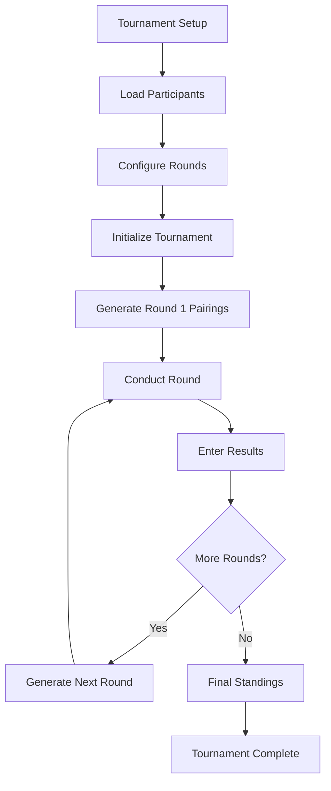

# MTG Tournament Dashboard Modification Requirements

## 1. Product Overview

Modify the existing MTG Tournament Dashboard to support larger tournaments with up to 16 teams competing in a single unified group format, replacing the current 2-group system. The enhanced system will provide configurable Swiss round options (3 or 4 rounds) while maintaining strict pairing constraints to ensure no teammates face each other and no players have repeat opponents throughout the tournament.

This modification addresses the need for larger tournament capacity and more flexible tournament formats while preserving the integrity of competitive Magic: The Gathering team events.

## 2. Core Features

### 2.1 User Roles

| Role | Registration Method | Core Permissions |
|------|---------------------|------------------|
| Tournament Organizer | Default access | Can load participants, configure tournament settings, manage rounds, input scores |
| Participant | Listed in Excel file | Can view tournament brackets, standings, and round pairings |

### 2.2 Feature Module

Our enhanced MTG Tournament Dashboard consists of the following main pages:

1. **Tournament Setup Page**: participant loading, team capacity configuration (up to 16 teams), Swiss round selection (3 or 4 rounds)
2. **Tournament Dashboard Page**: unified tournament view, round management, timer controls, live standings
3. **Pairing Management Page**: Swiss round pairing generation, constraint validation, pairing history
4. **Results Entry Page**: score input for each round, automatic standings calculation
5. **Tournament Overview Page**: complete tournament bracket view, final standings, tournament statistics

### 2.3 Page Details

| Page Name | Module Name | Feature description |
|-----------|-------------|---------------------|
| Tournament Setup | Participant Loader | Load up to 16 teams (64 players) from Excel file, validate team compositions, display team roster |
| Tournament Setup | Tournament Configuration | Select Swiss round count (3 or 4), set tournament parameters, initialize tournament structure |
| Tournament Setup | Team Validation | Ensure each team has exactly 4 players, validate no duplicate players, confirm team completeness |
| Tournament Dashboard | Unified Tournament View | Display all teams in single group format, show current round status, live tournament timer |
| Tournament Dashboard | Round Management | Navigate between Swiss rounds, display current round pairings, manage round progression |
| Tournament Dashboard | Live Standings | Real-time team rankings, individual player scores, tiebreaker calculations |
| Pairing Management | Swiss Pairing Engine | Generate optimal pairings using Swiss system logic, enforce teammate separation constraint |
| Pairing Management | Constraint Validation | Verify no repeat opponents, ensure no teammates paired, validate pairing integrity |
| Pairing Management | Pairing History | Track all previous matchups, maintain opponent history per player, prevent duplicate pairings |
| Results Entry | Score Input Interface | Enter match results for each table, support winner/loser/draw outcomes, validate score entries |
| Results Entry | Automatic Calculations | Update team standings, calculate individual scores, apply tiebreaker rules |
| Results Entry | Round Finalization | Lock round results, advance to next round, generate next round pairings |
| Tournament Overview | Complete Bracket View | Display all Swiss rounds simultaneously, show tournament progression, export tournament data |
| Tournament Overview | Final Standings | Calculate final rankings, display playoff qualifiers, generate tournament report |
| Tournament Overview | Statistics Dashboard | Show tournament metrics, pairing statistics, constraint compliance report |

## 3. Core Process

### Tournament Setup Flow
1. Organizer loads participant Excel file containing up to 16 teams
2. System validates team compositions (4 players each) and displays loaded teams
3. Organizer selects Swiss round configuration (3 or 4 rounds)
4. System initializes tournament structure and prepares pairing engine
5. Tournament begins with Round 1 pairing generation

### Swiss Round Flow
1. System generates optimal pairings for current round using Swiss logic
2. Pairings respect constraints: no teammates paired, no repeat opponents
3. Organizer starts round timer and manages round progression
4. Results are entered for each table upon match completion
5. System updates standings and advances to next round
6. Process repeats until all Swiss rounds are completed

### Tournament Completion Flow
1. Final Swiss round results determine tournament standings
2. System calculates final rankings with tiebreakers
3. Tournament overview displays complete results and statistics
4. Organizer can export tournament data and generate reports

## 4. User Interface Design

### 4.1 Design Style

- **Primary Colors**: Deep blue (#2c3e50) for headers and navigation, bright blue (#3498db) for interactive elements
- **Secondary Colors**: Success green (#27ae60) for positive actions, warning orange (#f39c12) for alerts
- **Button Style**: Rounded corners with subtle shadows, hover animations with 2px lift effect
- **Typography**: Segoe UI primary font, 16px base size, bold weights for headers and important information
- **Layout Style**: Card-based design with glassmorphism effects, top navigation with breadcrumbs
- **Icons**: Modern outline-style icons, consistent sizing, contextual colors matching action types

### 4.2 Page Design Overview

| Page Name | Module Name | UI Elements |
|-----------|-------------|-------------|
| Tournament Setup | Participant Loader | File upload area with drag-drop support, team cards in responsive grid, validation status indicators |
| Tournament Setup | Configuration Panel | Radio buttons for round selection, capacity slider (4-16 teams), prominent "Start Tournament" button |
| Tournament Dashboard | Main Tournament View | Large unified standings table, current round indicator, prominent timer display |
| Tournament Dashboard | Round Controls | Round navigation dropdown, timer controls (start/stop/reset), round status badges |
| Pairing Management | Pairing Display | Table cards showing 4-player pods, team color coding, constraint validation icons |
| Pairing Management | Validation Panel | Real-time constraint checking, violation alerts, pairing statistics dashboard |
| Results Entry | Score Input Grid | Table-based layout with score inputs, dropdown for match outcomes, batch submit functionality |
| Tournament Overview | Complete Bracket | Accordion-style round display, expandable table details, export controls |

### 4.3 Responsiveness

The application is desktop-first with mobile-adaptive design. Touch interaction optimization is implemented for tablet use during tournaments. Responsive breakpoints ensure usability on screens from 768px to 1920px width, with collapsible navigation and stacked layouts on smaller screens.